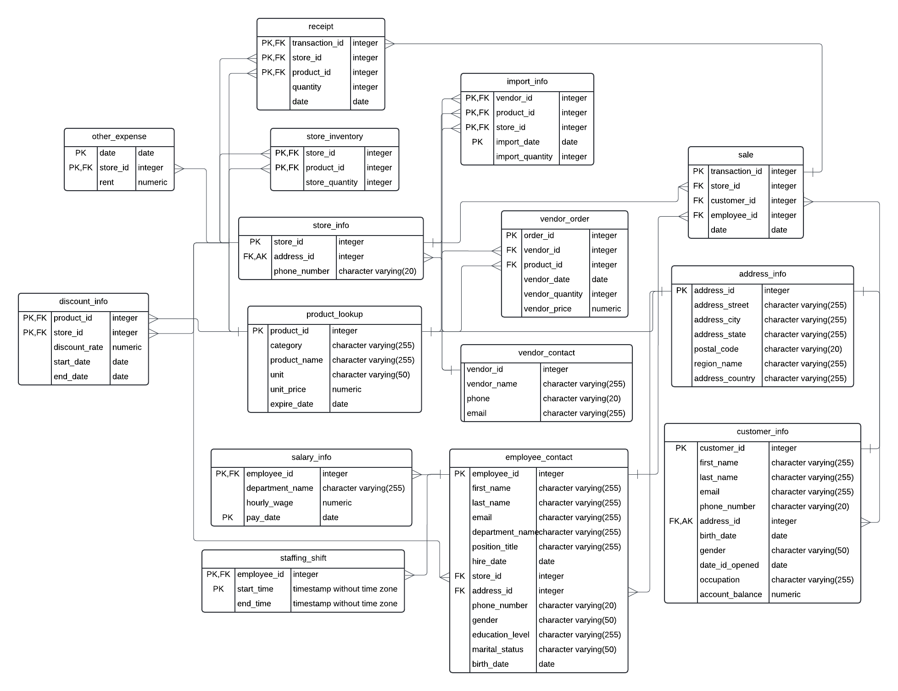

# APAN5310 group 8
This is the term project of group 8 for APAN 5310.
The team members include Xin Gao, Kiko Ma, Hao Tang, and Zijun Tao.

## Tasks & Timeline
For the team contract, we've specified and agreed on tasks and responsibilities as stated below including tasks, deadlines in parentheses, and people who are responsible for specific tasks.

### Task 1: Analyze requirements 

Define business requirements (03/30/2024) Xin, Hao

### Task 2: Design the database schema 

Define features needed for the database (04/03/2024) Xin, Hao

Define cardinality and relationships (ER diagram) (04/08/2024) Xin, Hao

Identify 1NF (04/11/2024) Hao

Identify 2NF (04/11/2024) Hao

Identify 3NF (04/11/2024) Hao

Create tables (04/14/2024) Hao, Kiko

### Task 3: Develop the database

ETL process copied in GitHub (04/20/2024) Xin, Hao, Kiko

Write at least 10 analytical procedures (04/20/2024) Xin, Zijun

Populate the database with sample data (04/21/2024) Kiko

Design Interactive dashboard (04/22/2024) Zijun

### Task 4: Written report (04/23/2024) 5-7 pages of text

Problem statement (04/10/2024) Xin

Proposal (04/12/2024) Zijun

Team structure and timeline (04/14/2024) Xin, Kiko

Database schema (04/20/2024) Hao

Analytics applications (04/23/2024) Zijun

Proofreading (04/23/2024) Xin

### Task 5: Powerpoint slides (04/22/2024) Xin, Hao, Kiko, Zijun

### Task 6: Presentation (04/24/2024) Xin, Hao, Zijun, Kiko

## database design
The project designed and developed the relational database system for the ABC Foodmart Scenario.

After defining features, tables, and normalization, we designed to build 15 tables for the database.

To run queries on your own computer:

1. open up Docker and PgAdmin
2. create a database named `5310 project`
3. run queries `5310_project_schema.sql`

The database contains the following tables.

**Core entities**: store; employee; customer; product; address information 

**product management & sale**: vendor order (tracking orders placed to vendors); sale and receipt (manages transactions between products and customers); store inventory (maintains a dynamic relation between store and product); import (manages relation between vendor and product)

**employee shift & salary**: staff shift (manages shift details for employees); salary (tracks salary for employee)

Then, we drew an ER diagram for the database as shown below.

## ETL & Analytical Procedures
We conducted the ETL process via Python. Also, we designed ten analytical procedures written in SQL queries, whose output could be seen through the same Python file.

The analytical procedures can answer the following questions:
1. Which store has the maximum overall profit?
2. Which product has the highest sales (so stores can restock more related products)?
3. In which area the company spends the most (to reduce potential cost)?
4. Identify customer segments to make informed marketing campaigns.
5. Identify products that are going to expire and add them to the discount table (optimize profit).
6. Which region has the highest sales?
7. During which period did we get the highest passenger flow (by sale time)?
8. Which cashier has made the most transactions or the largest profit (stimulate employees by giving bonuses)?
9. Calculate the salary of each employee in December 2022.
10. Identify the 10 sellers with the lowest volumes and give warnings.

You can view the ETL process and analytical procedures in Python through `APAN5310_project.ipynb`

You can also check SQL queries for analytical procedures through  `queries.sql`

## Dashboard
We built the dashboard based on analytical procedures by entering queries in Metabase and forming visualizations. Audiences are welcome to click over the tables to view specific information.

You can view the dashboard through `ABC Foodmart operation analysis`

